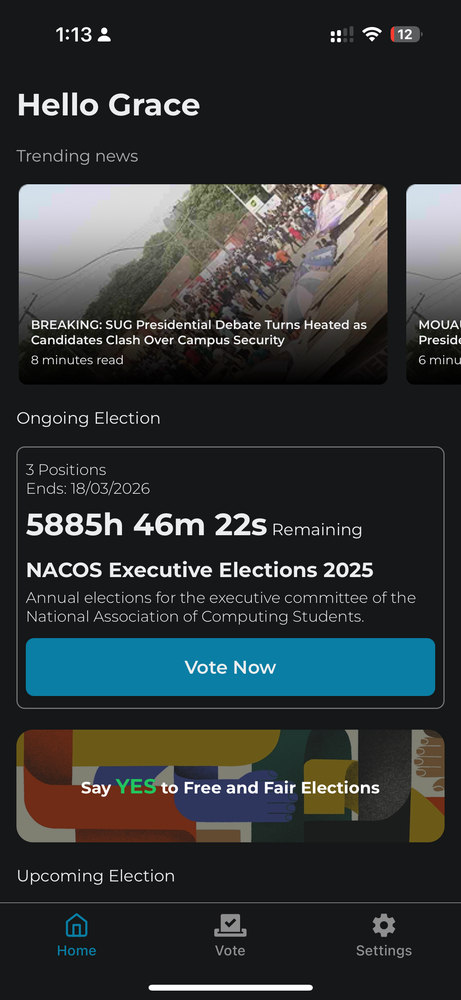
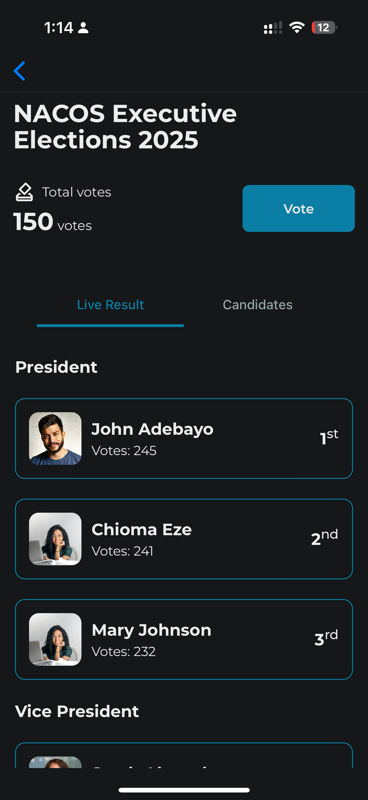
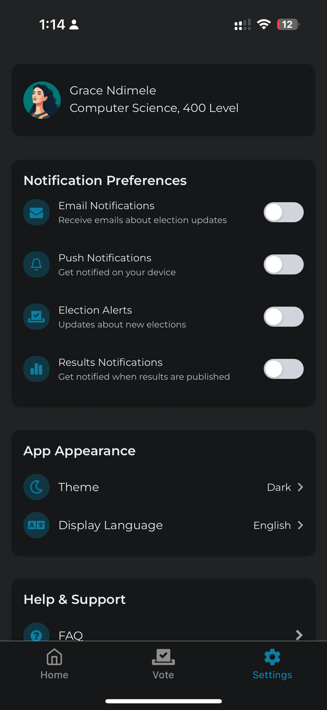

# MOUAU E-Voting System 🗳️

A modern, secure, and user-friendly mobile voting platform designed for Michael Okpara University of Agriculture,
Umudike (MOUAU). This cross-platform application enables seamless digital elections with real-time results and robust
security features.

## 🎓 Academic Project

**Final Year Project**  
**Institution:** Michael Okpara University of Agriculture, Umudike (MOUAU)  
**Program:** Bachelor of Science BSc.  
**Academic Year:** 400 Level

## 🚀 Features

- **Cross-Platform Compatibility** - Works on both iOS and Android
- **Real-time Voting** - Instant vote counting and results
- **Secure Authentication** - Multi-layer security system
- **User-Friendly Interface** - Intuitive design for all users
- **Offline Capability** - Vote storage when network is unavailable
- **Admin Dashboard** - Complete election management system
- **Vote Analytics** - Comprehensive reporting and statistics

## 🛠️ Tech Stack

- **Framework:** React Native with Expo
- **Language:** TypeScript
- **Styling:** Tailwind CSS (NativeWind)
- **State Management:** Zustand
- **Database:** `To be implemented`
- **Authentication:** `To be implemented`
- **Backend:** `To be implemented`

## 📱 Screenshots

### Voter App

<div align="center">
  
  
  
  
</div>

## 🔧 Installation & Setup

### Prerequisites

- Node.js (v16 or higher)
- npm or yarn
- Expo CLI
- Git

### Clone the Repository

```bash
git clone https://github.com/h1rdr3v2/mouau-evoting-system.git
cd mouau-evoting-system
```

### Install Dependencies

```bash
npm install
# or
yarn install
```

### Run the Application

```bash
# Start the development server
npm start
# or
yarn start

# For specific platforms
npm run android
npm run ios
```

## 🏗️ Project Structure

```
mouau-evoting-system/
├── src/
│   ├── app/               # Application
│   ├── components/        # Reusable UI components
│   └── core/              # Navigation configuration
│      ├── store/          # Zustand store configurations
│      ├── services/       # API and external services
│      ├── utils/          # Utility functions
│      └── types/          # TypeScript type definitions
├── assets/                # Images, fonts, and other assets
└── __tests__/             # Test files
```

## 🔐 Security Features

- End-to-end encryption for vote data
- Secure user authentication
- Vote integrity verification
- Audit trail logging
- Anti-fraud mechanisms

## 📊 Core Functionality

### For Voters

- Secure login/registration
- View available elections
- Cast votes securely
- View election results
- Vote history tracking

### For Administrators (not available yet)

- Election creation and management
- Candidate management
- Real-time monitoring
- Results compilation
- User management

## 🧪 Testing

```bash
# Run tests
npm test

# Run tests with coverage
npm run test:coverage
```

## 📈 Performance Optimization

- Optimized bundle size
- Efficient state management
- Lazy loading implementation
- Caching strategies
- Offline-first architecture

## 🤝 Contributing

This is an academic project, but suggestions and feedback are welcome!

1. Fork the repository
2. Create your feature branch (`git checkout -b feature/AmazingFeature`)
3. Commit your changes (`git commit -m 'Add some AmazingFeature'`)
4. Push to the branch (`git push origin feature/AmazingFeature`)
5. Open a Pull Request

## 📄 License

This project is licensed under the MIT License - see the [LICENSE](LICENSE) file for details.

## 👨‍💻 Author

**Destiny Ezenwata**

- GitHub: [@h1rdr3v2](https://github.com/h1rdr3v2)
- LinkedIn: [Destiny's LinkedIn Profile](https://linkedin.com/in/destinyezenwata)
- Email: destinyezenwata@gmail.com

**Academic Supervisor:** Mr. Chigbundu Kanu  
**Department:** Computer Science  
**University:** Michael Okpara University of Agriculture, Umudike

## 🙏 Acknowledgments

- Michael Okpara University of Agriculture, Umudike
- Mr. Chigbundu Kanu for academic guidance
- React Native and Expo communities
- All contributors and testers

## 📞 Support

For support, email destinyezenwata@gmail.com or create an issue in this repository.

---

**Note:** This is an academic project developed for educational purposes as part of a final year project at MOUAU.
